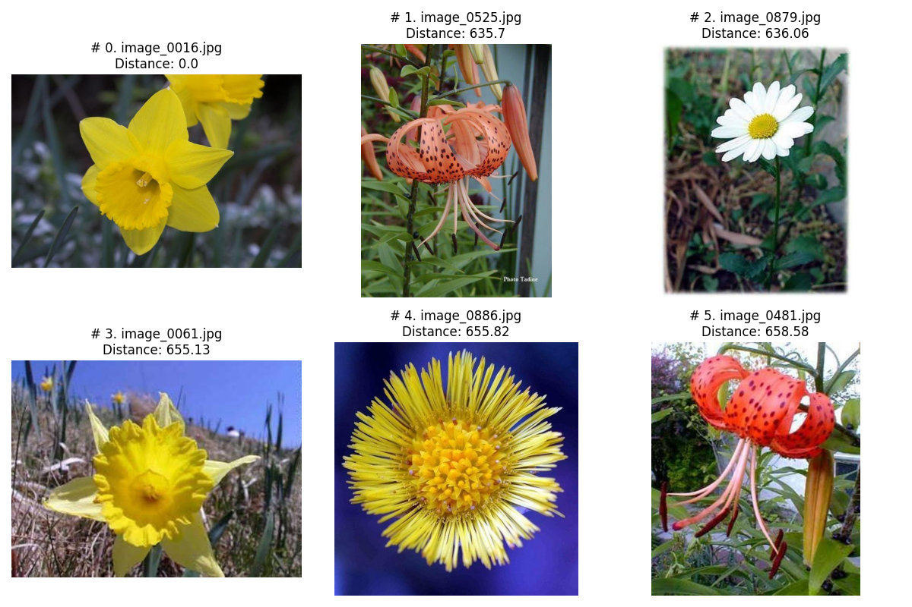
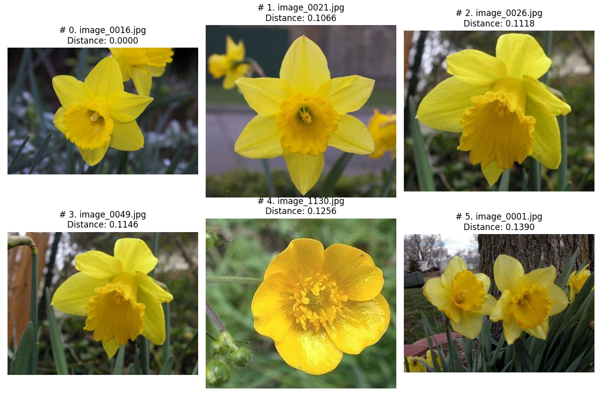

# CDS Visual Analytics Assignment #1: Simple Image Search Algorithm (+KNN)

## What is this?
This assignment features a script that can perform a "crude"/simple image search, based on comparing color histograms with each other, and finding the ones with the least difference between the target image.
A second script has also been added per `notebook session 10`, which performs an improved image search using K-Nearest Neighbor.
Both scripts produce a `.csv` containing the similar images found along with their distances to the target image, as well as saving a plot showing the images found. These can be found in the `out` folder.

## Setup
1. Make sure to have python and Git Bash installed!

2. Open a Git Bash terminal and use Git to download the repository:

```sh
git clone https://github.com/missingusername/cds-vis-git.git
```

3. Navigate to the project folder for this assignment:

```sh
cd assignments/assignment1
```

4. Before doing anything else, you first need to get the flower data. You can download the `17flowers.tgz` manually from [the Visual Geometry Group at the University of Oxford](https://www.robots.ox.ac.uk/~vgg/data/flowers/17/), or simply by clicking [here](https://www.robots.ox.ac.uk/~vgg/data/flowers/17/17flowers.tgz). When downloaded, unzip the folder and place the `jpg` folder inside the `in` folder of the `assignment1` directoy.

5. Before you can run the scripts, make sure you have the required libraries in the `requirements.txt`. This can be done by simply running the OS-appropriate setup script from inside the `assignment1` folder, which will set up a virtual environment and get the required libraries. Again, using Git Bash:

For Unix:
```sh
bash unix_setup.sh
```
For Windows:
```sh
bash win_setup.sh
```

6. The scripts can take these command line arguments on execution:

| name | flag | description | is required |
|   -   |   -   |   -   |   -   |
| target | -t | The number code of the target image. Simply find an image in the `jpg` folder you want to search for. For example, `image_0016.jpg` would just require you to input `16`, as it automatically pads the number with 0's to ensure it is 4 digits long. | *REQUIRED |
| similar | -s | How many similar images to search for (Default = 5) | OPTIONAL |

7. To finally execute the scripts (`simple_search.py` & `knn_search.py`), simply run the OS-appropriate `run.sh` script in the same Git Bash terminal:

(Unix) Find similar images to `image_0016.jpg`
```sh
bash unix_run.sh -t 16
```
(Windows) Find 10 similar images to `image_0016.jpg`
```sh
bash win_run.sh -t 16 -s 10
```
## Takeaways from output

**Simple search results:**
|Filename      |Distance  |
|--------------|----------|
|image_0016.jpg|0.0       |
|image_0525.jpg|635.7     |
|image_0879.jpg|636.06    |
|image_0061.jpg|655.13    |
|image_0886.jpg|655.82    |
|image_0481.jpg|658.58    |



Here we can see that the simple search doesnt perform particularly well. While writing and testing the script on different files, distances can range anywhere from the tens to hundreds, meaning that it is not a particularly reliable form of image searching. This is also visible by looking at the resulting plot showing the images, where we can see that even if the images have similar distances (630~660), only 1 of the flowers appears to be of the same species as the target.

**KNN results:**
|Filename      |Distance  |
|--------------|----------|
|image_0016.jpg|0.0       |
|image_0021.jpg|0.1065824 |
|image_0026.jpg|0.1117754 |
|image_0049.jpg|0.11462957|
|image_1130.jpg|0.12564445|
|image_0001.jpg|0.13901663|



Here, in comparison to the simple search, we see distances consistently in the 0's. We can also see that the images found are visually much closer to the target image, with many ofthem being the same species of flower. This clearly marks it as the the more reliable image search method, but it also has a consistently longer processing time. This can however be combatted, which we will explore in the following code section.

## The Code
### Simple Image Search
The script works by simply looping through every `.jpg` file in the `jpg` folder. For each file, we load it as an openCV image, create an RGB histogram for it, and then normalize the histogram afterwards.

When the normalized histogram has been made, we compare each one with the target images histogram using the `HISTCMP_CHISQR` method. After comparing, we add the images name and its distance (rounded to 2 decimal points) to a tuple, and append that tuple to a list called `results`.
When every image and its distance has been calculated and added to the list, the results are sorted based on the computed distance. The top `N` similar images (plus the target image) are selected for display.

Then, we plot and show the images using matplotlib, so we can see if they are actually similar to the target image. This plot is also saved as `similar_simple.png` in the `out` folder.
Lastly, we convert the results to a pandas dataframe, and also save that as a `.csv` file in the `out` folder.

### Nearest Neighbor Search
As per the session 10 notebook, i have also added a script that utilizes Nearest-Neighbor searching. 

The script works by using a pre-trained VGG16 model to extract features from every `.jpg` file in the `jpg` folder. For each file, we load it as a TensorFlow image, preprocess it, and then extract features using the VGG16 model. The extracted features are normalized for consistency.

Once the features for all images are extracted, they are saved to a file for future use. If the feature file already exists, it is loaded instead of recalculating the features, saving time on subsequent runs.

When searching for similar images, the script uses the extracted features and applies the K-Nearest Neighbors (KNN) algorithm. The KNN model is trained on the feature set and then used to find the nearest neighbors to the target image based on cosine distance. The distances and indices of the nearest neighbors are stored in a list of tuples, which is then sorted by distance.

The top `N` similar images (plus the target image) are selected for display. These images are plotted using Matplotlib, showing the target image and its most similar matches in a grid layout. The plot is saved as `similar_knn.png` in the `out` folder. Additionally, the results are saved as a `.CSV` file in the `out` folder, providing a record of the filenames and their distances from the target image. I have chosen not to round the distances for this one, as the KNN performs substantially better than the simple search, and thus could use the extra decimals to distinguish between distances.

### Limitations & improvement.

Since these scripts were made specifically with the flower dataset in mind, the scripts only work if the image files follow the same naming convention of the flower daaset, e.g. `image_1023.jpg`. The script could be re-written to take *any* filename as an argument, however i opted to keep the ability to simply pass the numerical code of the target image, as i found it simpler and faster.
In the KNN script, i dump the feature_list after processing, and laod it in future runs to save time. I also wanted to try to implement this in the simple search, by dumping the histograms to a file for quicker loading on subsequent runs, but while trying to implement this i would run out of memory when reaching ~750 histograms. This leads to keeping hte original method of having to compute the histograms on each run.
This means that despite the KNN being slower on the initial search, it will eventually be faster if counting subsequent runs.
