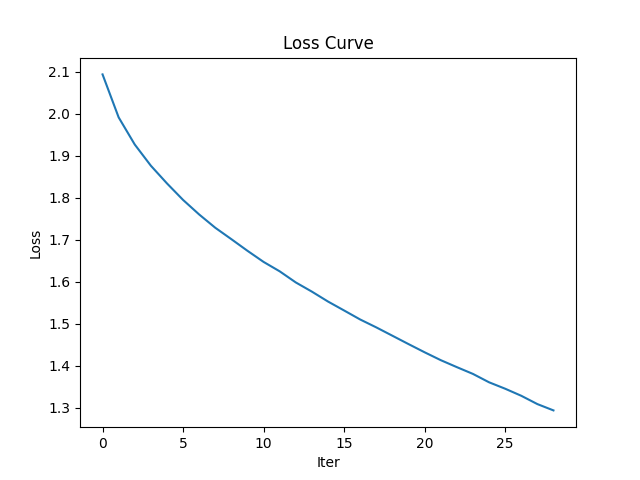

# CDS Visual Analytics Assignment #2: Cifar10 Classification Benchmarks

## What is it?
This assignment aims to benchmark 2 ways of doing image clasification on the Cifar10 dataset. The repository features an MLP (Multi-Layer Perceptron) classification script, as well as a logistic regression classifier script. Both scripts generate text reports in the `/out` folder, along with a loss curve for the MLP classifier.

## Setup
1. Make sure to have python and Git Bash installed!

2. Open a Git Bash terminal and use Git to download the repository:

```sh
git clone https://github.com/missingusername/cds-vis-git.git
```

3. Navigate to the project folder for this assignment:

```sh
cd assignments/assignment2
```

4. Before you can run the scripts, make sure you have the required libraries in the `requirements.txt`. This can be done by simply running the OS-appropriate setup script from inside the `assignment2` folder, which will set up a virtual environment and get the required libraries. Again, using Git Bash:

For Unix:
```sh
bash unix_setup.sh
```
For Windows:
```sh
bash win_setup.sh
```

5. To finally execute the scripts (`logreg.py` & `mlp.py`), simply run the OS-appropriate `run.sh` script in the same Git Bash terminal:

Unix: 
```sh
bash unix_run.sh
```
Windows: 
```sh
bash win_run.sh
```
## Takeaways from output

<table>
<tr><th>Logistic Regression</th><th>MLP</th></tr>
<tr><td>

|           | precision | recall | f1-score | support |
|-----------|-----------|--------|----------|---------|
| airplane  |   0.32    |  0.37  |   0.34   |  1000   |
| automobile|   0.26    |  0.28  |   0.27   |  1000   |
| bird      |   0.21    |  0.16  |   0.18   |  1000   |
| cat       |   0.16    |  0.14  |   0.15   |  1000   |
| deer      |   0.20    |  0.17  |   0.18   |  1000   |
| dog       |   0.26    |  0.25  |   0.26   |  1000   |
| frog      |   0.20    |  0.19  |   0.20   |  1000   |
| horse     |   0.23    |  0.23  |   0.23   |  1000   |
| ship      |   0.31    |  0.36  |   0.33   |  1000   |
| truck     |   0.30    |  0.41  |   0.35   |  1000   |
| accuracy  |           |        |   0.25   |  10000  |
| macro avg |   0.25    |  0.25  |   0.25   |  10000  |
| weighted avg |  0.25 |  0.25  |   0.25   |  10000  |

</td><td>

|           | precision | recall | f1-score | support |
|-----------|-----------|--------|----------|---------|
| airplane  |   0.41    |  0.43  |   0.42   |  1000   |
| automobile|   0.39    |  0.39  |   0.39   |  1000   |
| bird      |   0.30    |  0.33  |   0.31   |  1000   |
| cat       |   0.24    |  0.21  |   0.22   |  1000   |
| deer      |   0.27    |  0.15  |   0.19   |  1000   |
| dog       |   0.35    |  0.32  |   0.34   |  1000   |
| frog      |   0.32    |  0.39  |   0.35   |  1000   |
| horse     |   0.43    |  0.36  |   0.39   |  1000   |
| ship      |   0.45    |  0.46  |   0.46   |  1000   |
| truck     |   0.35    |  0.51  |   0.42   |  1000   |
| accuracy  |           |        |   0.35   |  10000  |
| macro avg |   0.35    |  0.35  |   0.35   |  10000  |
| weighted avg |  0.35 |  0.35  |   0.35   |  10000  |

</td></tr> </table>

We can see that both models dont seem to perform particularly well, especially on animals, which consistently score lower than objects like ships, trucks and airplanes. The MLP calssifier does seem to perform substantially better on some animals though, noticably improving performance on horses, frogs, dogs and birds.

As we can see from the weighted avg. f1-scores of the classifiers, where despite both models not performing particularly well, the MLP classifier still performs noticably better. Despite both models being trained fairly quickly, the MLP classifier trains slightly slower (Using "early_stopping" can cut the processing short if no progress is made over multiple iterations).



Looking at the loss curve, we can see the loss curve initially dropping off steeply, tapering out when we increase the amount of iterations. This is expected, as the model starts with random weights and makes poor predictions. Over the iterations, the loss decreases as the model adjusts its weights to improve predictions and minimize errors. The curve stabilizes, indicating that further training may not significantly reduce the loss. This also shows the relevance of utilizing "early_stopping" during training, to avoid unnecessary training.
